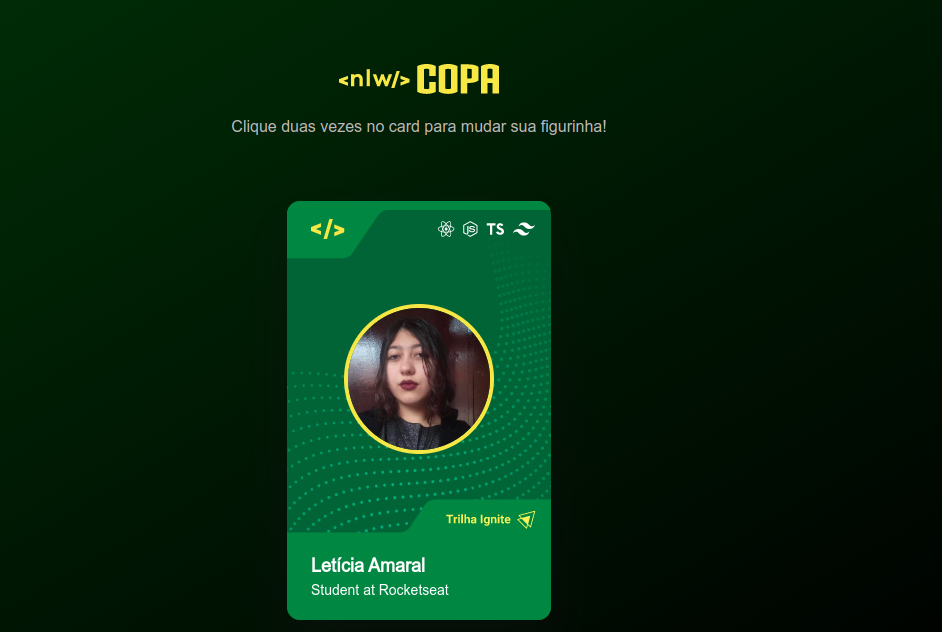

# Figurinha da Copa

Projeto de aquecimento para a semana de NLW Copa do mundo feita pela [Rocketseat](https://www.rocketseat.com.br/), onde foi montado a figurinha de trilhas do evento.

---

## Ferramentas

- HTML
- CSS
- Javascript

---

## Desenvolvimento

- [Layout Figma](https://www.youtube.com/redirect?event=video_description&redir_token=QUFFLUhqbGxzVWI1VmNJVDFDMFZPaXRMSWVtczhQMm5Gd3xBQ3Jtc0tuYngwbWpOY2ZLLWZqZmlXMzRyc05QQnB5NzN2SnFiTGFLX2RpWG5ibGVBbExjQ0lWaW5hREx2b3o3Q0JnQlkyQmkwNm5TSzgyaFdoNWRzTWxucFM5TnlIeTI0QnE0eGpmNF9EWTlKYWZGZEdPTjMwSQ&q=https%3A%2F%2Fwww.figma.com%2Ffile%2Fn4a3jhGZQzysXClp99bfyT%2FNLW-Copa-Card%2Fduplicate&v=sswJisbD2CY)

**Detalhes do Javascript:**

- Feita função chamada _changeCard_ onde captura o evento ocorrido de duplo clique no cartão, usando o _ondblclick_, para ser executada.
- Com a variável _isIgnite_ iniciando como verdadeira, se usa condicional para verificar se o cartão usado é Ignite ou Explorer( referente as duas trilhas do evento ).
